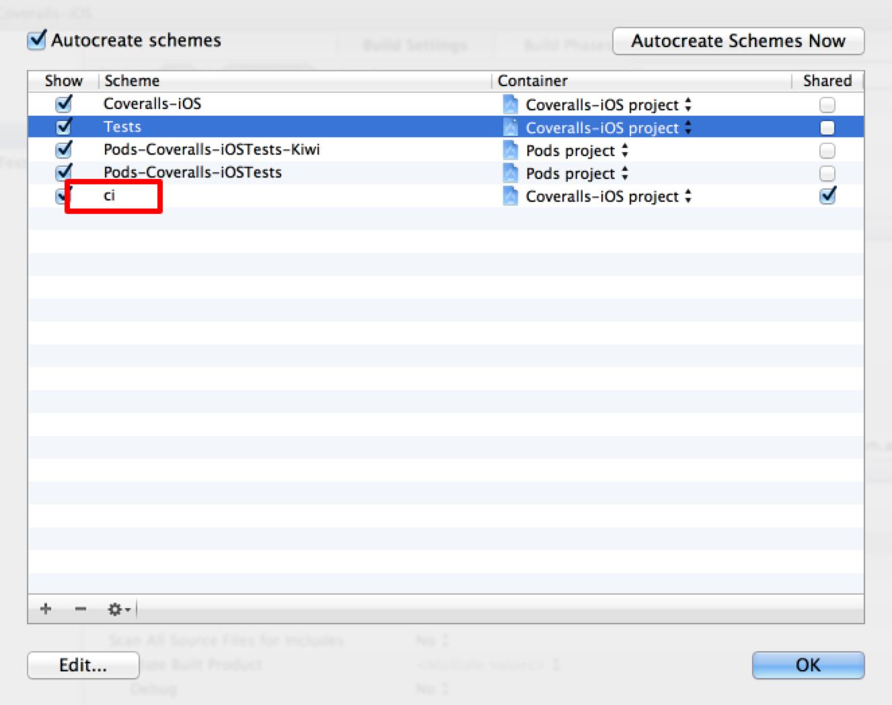

# Coveralls-iOS example

minimum setup for Coveralls.

* [](https://travis-ci.org/azu/Coveralls-iOS)
* [](https://coveralls.io/r/azu/Coveralls-iOS?branch=master)

## How to

```
Travis CI 
	xctool test
   ↓
 	coveralls.sh
 		generate gcov 	
 		↓
 		cpp-coveralls
 		↓
 		POST
   ↓
Coveralls
```

## What's ci scheme?

This project has ``ci`` scheme.



Setting ci scheme for Travis CI.(for xctool)

### if you use cocoapods & xctool

xctool doesn't support ``Find Implicit Dependencies``.

You have to setting following page.

* [ld: library not found for -lPods · Issue #16 · facebook/xctool](https://github.com/facebook/xctool/issues/16#issuecomment-17444311 "ld: library not found for -lPods · Issue #16 · facebook/xctool")


1. clear the check box for ``Find Implicit Dependencies``
2. prepend static Pods file.

#### run test

	xctool test ONLY_ACTIVE_ARCH=NO GCC_INSTRUMENT_PROGRAM_FLOW_ARCS=YES GCC_GENERATE_TEST_COVERAGE_FILES=YES

### case xcodebuild

see ``script/run-test.sh``

``` sh
#!/bin/sh

xcodebuild \
	-project Coveralls-iOS.xcodeproj \
	-sdk iphonesimulator \
	-target Coveralls-iOSTests \
	-configuration Debug \
	clean build \
	ONLY_ACTIVE_ARCH=NO \
	TEST_AFTER_BUILD=YES \
	GCC_INSTRUMENT_PROGRAM_FLOW_ARCS=YES \
	GCC_GENERATE_TEST_COVERAGE_FILES=YES 
```

## Contributing

1. Fork it!
2. Create your feature branch: `git checkout -b my-new-feature`
3. Commit your changes: `git commit -am 'Add some feature'`
4. Push to the branch: `git push origin my-new-feature`
5. Submit a pull request :D

## License

MIT